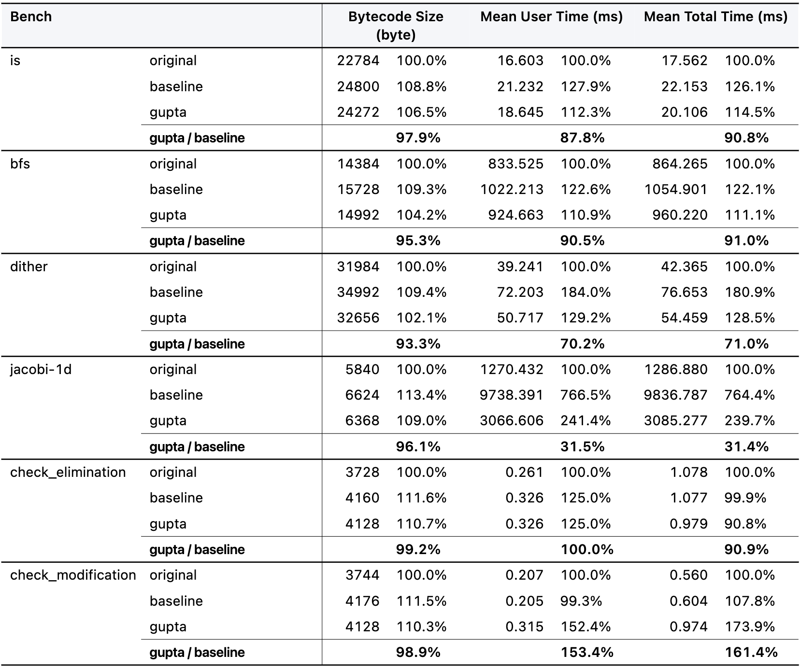
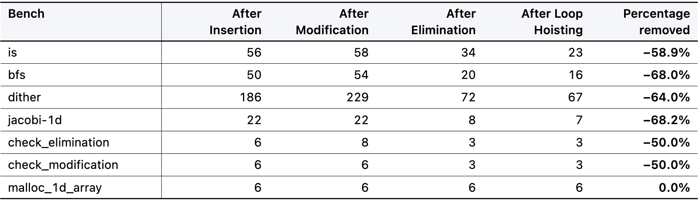
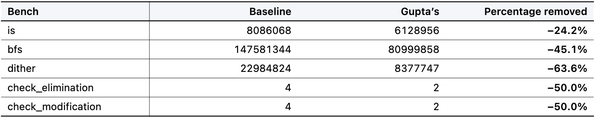
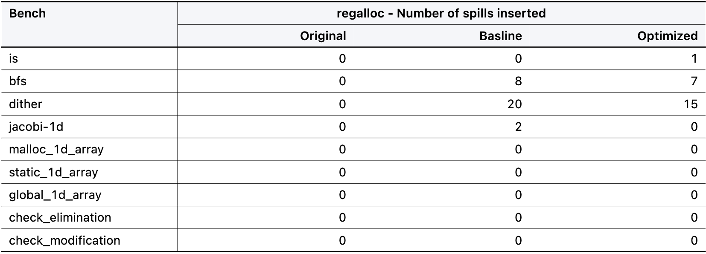

# An LLVM pass for bound check insertion and optimization based on Gupta et al.'s paper

This repository contains an LLVM pass for bound check insertion and optimization based on the paper **Optimizing array bound checks using flow analysis** by Gupta et al. 

## Benchmarks

### Code size and speed 

### Compile time check counts

### Run time check counts

### Register pressure

